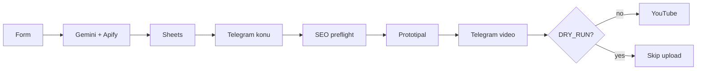

# Kanallar

Cloud-first YouTube Shorts factory. **n8n is how it runs** — not a side script.

## How n8n works (start here)

Full write-up: **[`docs/N8N_HOW_IT_WORKS.md`](docs/N8N_HOW_IT_WORKS.md)** · Import notes: **[`n8n/README.md`](n8n/README.md)**

**Primary file in git:** `n8n/workflows/primary/youtube-full-pipeline.json`  
**Live name:** `PRIMARY: YouTube Full (sade)`

| Stage | What n8n does |
|-------|----------------|
| Research | Form → Gemini keywords → Apify scrape → Sheets |
| Prompt | Gemini titles / scenes → Sheets queue |
| Gate 1 | Telegram topic approval |
| Produce | SEO check → Prototipal → poll until ready |
| Gate 2 | Telegram video approval |
| Publish | `DRY_RUN?` then YouTube Upload |

Defaults: `DRY_RUN=true`, `AUTO_PUBLISH=false`. Never commit secrets.

## Ideas we steal carefully

From [darkzOGx/youtube-automation-agent](https://github.com/darkzOGx/youtube-automation-agent): approval-first, SEO preflight, analytics learning — **patterns only**, still n8n-owned. See [`docs/IDEAS_FROM_AGENTTUBE.md`](docs/IDEAS_FROM_AGENTTUBE.md).

## Upgrade kit (optional)

Postgres / FFmpeg hybrid / Kie wow / token approvals — worker under `apps/studio`, Hybrid workflow under `n8n/workflows/kanallar-shorts-factory.json`.

## More docs

[`docs/PRIMARY_STACK.md`](docs/PRIMARY_STACK.md) · [`docs/PROJECT_STATE.md`](docs/PROJECT_STATE.md) · [`docs/ARCHITECTURE.md`](docs/ARCHITECTURE.md)
