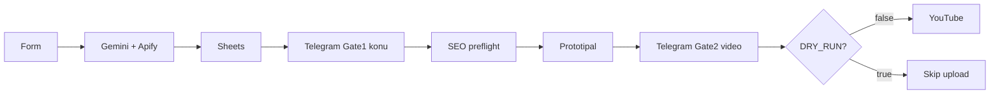

# Kanallar

Cloud-first YouTube Shorts factory. **Primary OS = n8n.**

## Read this first (humans + ChatGPT + Claude)

**Adım adım akış:** [`docs/AKIS.md`](docs/AKIS.md) ← projeyi buradan anla.  
**Denemelik 1 video:** [`docs/DENEME.md`](docs/DENEME.md)  
**Review + değerlendirme:** [`docs/CHATGPT_WORKFLOW_REVIEW.md`](docs/CHATGPT_WORKFLOW_REVIEW.md) · [`docs/REVIEW_EVALUATION.md`](docs/REVIEW_EVALUATION.md)

Kısa özet: [`docs/N8N_HOW_IT_WORKS.md`](docs/N8N_HOW_IT_WORKS.md) · Import: [`n8n/README.md`](n8n/README.md)

| | |
|--|--|
| **Live workflow** | `PRIMARY: YouTube Full (sade)` |
| **JSON in git** | `n8n/workflows/primary/youtube-full-pipeline.json` |
| **Telegram chat** | `8715342169` |
| **Defaults** | `DRY_RUN=true`, `AUTO_PUBLISH=false` |

### Steps (one line each)

1. Form → Gemini keywords → Apify YouTube scrape → Sheets  
2. Gemini topics / titles / scene prompts → Sheets queue  
3. **Gate 1** Telegram: approve calendar (no paid video yet)  
4. SEO check → Prototipal create → poll until ready  
5. **Gate 2** Telegram: approve video  
6. If `DRY_RUN=false` → YouTube Upload; else skip  

## For AI assistants

When explaining or changing this project: follow [`docs/AKIS.md`](docs/AKIS.md). Do not treat `n8n/archive/` or the Python worker as the primary path.

## Upgrade kit (optional)

Postgres / FFmpeg / Kie wow / Studio API — see `docs/ARCHITECTURE.md`. Archived n8n stubs live under `n8n/archive/`.

## More

[`docs/PRIMARY_STACK.md`](docs/PRIMARY_STACK.md) · [`docs/PROJECT_STATE.md`](docs/PROJECT_STATE.md) · [`AGENTS.md`](AGENTS.md)
