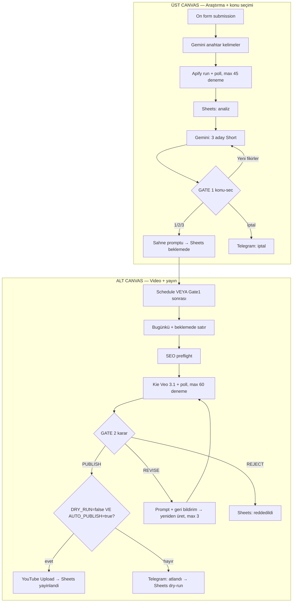

# KANALLAR — Adım adım akış (AI / insan okuma kılavuzu)

Bu dosya GitHub’dan okuyan **ChatGPT, Claude, Cursor** ve insanlar içindir.
Amaç: projeyi açınca **nasıl çalıştığını** tek başına anlayabilmek.

| | |
|--|--|
| **Birincil sistem** | n8n (orchestration) |
| **Canlı workflow adı** | `PRIMARY: YouTube Full (sade)` |
| **Repo JSON** | [`n8n/workflows/primary/youtube-full-pipeline.json`](../n8n/workflows/primary/youtube-full-pipeline.json) |
| **Güncelleme script’i** | [`n8n/scripts/apply_review_updates.py`](../n8n/scripts/apply_review_updates.py) |
| **Telegram onay chati** | chat id `8715342169` |
| **LLM** | OpenAI `gpt-4.1-mini` (Gemini ücretsiz katman model başına günde 20 istek — bir tura yetmiyor) |
| **Seri** | Haftada 1 Short — `Fatih Sultan Mehmed`, İngilizce |
| **Yayın anahtarı** | `yayin-ayari` node’u (şu an açık, public); Gate 2 PUBLISH yine zorunlu |

Python worker / Studio / archive Hybrid = **opsiyonel upgrade**. Günlük Shorts üretimi = bu n8n akışı.

---

## 30 saniyelik özet

```
1) Form → Gemini anahtar kelime → Apify YouTube scrape (max ~15 dk) → Sheets
2) Gemini: 3 ADAY Short (başlık / açıklama / tema)
3) GATE 1 Telegram formu: 1 / 2 / 3 / Yeni fikirler / İptal
4) Seçilen konu → sahne promptu → Sheets satırı durum=beklemede
5) SEO kontrol → Prototipal video (max ~30 dk)
6) GATE 2 Telegram formu: PUBLISH / REVISE / REJECT (+ geri bildirim)
7) PUBLISH → DRY_RUN=false VE AUTO_PUBLISH=true ise YouTube; değilse atla
8) Sheets durum: yayinlandi / dry-run / reddedildi
```

Gate 1’den önce pahalı video API çağrılmaz; Gemini de sadece seçilen konu için sahne yazar.
Aynı satır ikinci kez üretilmez: yalnızca `durum=beklemede` olan bugünkü satırlar işlenir.

---

## Büyük resim



---

## BÖLÜM A — Araştırma ve konu seçimi (üst canvas)

### A0 — Tetikleyici
- `On form submission` — manuel: Konu, Hafta Sayısı (kullanılmıyor), İçerik Dili
- `haftalik-tetik` — **her pazartesi 10:00 (Europe/Istanbul)** → `haftalik-girdi`: Konu `Fatih Sultan Mehmed`, dil `en`

### A1 — Girdiler
**Node:** `girdiler` — form alanlarını `konu`, `hafta`, `dil` yapar.

### A2 — Anahtar kelimeler
**Node:** `anahtar-kelimeler` (LLM Chain + Gemini + Structured Output Parser) → `terim1…terim10`.

### A3 — Apify scrape (sınırlı bekleme)
1. `basla` — actor run başlatır, dönen `data.id` = run ID
2. `Wait1` — 20 sn
3. `kontrol` — **o run’ın** durumu: `actor-runs/{run_id}`
4. `If1` — `SUCCEEDED` ise devam
5. `apify-tekrar?` — READY/RUNNING ve 45 denemeden az ise tekrar bekle; değilse `apify-hata` (Telegram)
6. `sonuc` — **o run’ın** dataset’i: `datasets/{defaultDatasetId}/items`
7. `en-iyiler` — izlenmeye göre ilk 5

### A4 — Analiz kaydı
`analiz-kayit` → Sheets `analizler`.

### A5 — Video başına konu analizi
`icerik-bilgileri` → `Loop Over Items` → `konu-yazarı` → `ai-konu-guncelle` → `Aggregate`.

### A6 — 3 aday Short
`icerik-fikir-baslik-aciklama` (Gemini) → `icerik` (Code, satırlara çevirir).

### A7 — GATE 1: konu seçimi
1. `adaylar` — 3 adayı tek mesaja toplar
2. `konu-sec` — Telegram formu: **1 / 2 / 3 / Yeni fikirler / Iptal** (+ Not)
3. `secilen-konu` — seçilen adayı alır, `tarih` = bugün (Europe/Istanbul, örn. `23 Eylül 2026`)
4. `secildi?` → evet: `icerik-kayit` (Sheets’e tek satır)
5. `yeni-fikir?` → evet: tekrar A6 (en fazla 2 kez); hayır: `konu-iptal`

### A8 — Sahne promptu
`Loop Over Items1` → `If` (long/short) → `sahne-promptlari` veya `Basic LLM Chain` → `prompt-guncelle(1)`.

### A9 — Onaylandı işareti ve köprü
`onaylandi` — **sadece seçilen tarihli satırı** `durum=beklemede` yapar → `tarih` (alt canvas).

---

## BÖLÜM B — Video üretimi ve yayın (alt canvas)

Girişler: `Schedule Trigger` (günlük) veya A9 köprüsü.

### B1 — Satır seçimi
`tarih` → `icerikler` (Sheets) → `tarih-kontrol`: **tarih = bugün VE durum = beklemede**.

### B2 — SEO preflight (her satır için)
`SEO preflight` → `SEO OK?` — başlık ≤ 40 (long ≤ 60), açıklama ≥ 20 karakter, sahne-prompt dolu.
Hata → `SEO fail` (Telegram), video üretilmez.

### B3 — Video (Kie.ai Veo 3.1, sınırlı bekleme)
`olustur` → `POST api.kie.ai/api/v1/veo/generate` (`veo3_fast`, 9:16) → `Wait` 30 sn → `video-kontrol` (`veo/record-info`) → `video-bitti?` (`successFlag=1`)
→ değilse `video-tekrar?`: `successFlag=0` ve 60 denemeden az ise bekle; değilse `video-hata` (Kie mesajıyla).
`video-gonder` videoyu Gate 2’den önce Telegram’a yollar.

### B4 — GATE 2
`onay?` — Telegram formu: **PUBLISH / REVISE / REJECT** + Geri bildirim → `karar` (Code)
- `video-onay?` PUBLISH → `indir`
- `revize?` REVISE → `revize-prompt` (geri bildirimi prompt’a ekler, max 3) → `olustur`
- REJECT → `reddedildi` (Sheets durum)

### B5 — Yayın kapısı
`yayin-ayari` (Code, `tarih` sonrası) tek anahtar: `YAYIN_ACIK`, `GIZLILIK`.
Şu an operatör isteğiyle `YAYIN_ACIK=true`, `GIZLILIK=public`. Gate 2’de **PUBLISH** seçilmeden yine yüklenmez.
`DRY_RUN?` bu anahtara bakar. Kapatmak için `n8n/scripts/setup_weekly_series.py` içinde `PUBLISH_ENABLED=False`.
- evet → `Upload a video` → `yayinlandi` (Sheets)
- hayır → `DRY_RUN skip` (Telegram) → `dry-run-kayit` (Sheets)

---

## Sheets durum değerleri

| durum | Anlamı |
|-------|--------|
| `onaylanmadı` | Satır yazıldı, sahne hazırlanıyor |
| `beklemede` | Gate 1 geçti, üretime hazır |
| `dry-run` | Video üretildi, yükleme bilerek atlandı |
| `yayinlandi` | YouTube’a yüklendi |
| `reddedildi` | Gate 2’de reddedildi |

Sadece `beklemede` üretilir → aynı video iki kez üretilmez/yüklenmez.

---

## Credential / token checklist

1. OpenAI account (chat modelleri)
2. Google Sheets OAuth
3. Telegram Bot `@Yt_ammar_bot` (credential `Telegram Yt_ammar_bot`) → chat `8715342169`
4. YouTube OAuth (sadece gerçek upload’da)
5. Apify token — canlı n8n’de, **git’te yok**
6. Kie.ai API key — `olustur` / `video-kontrol` header (canlı n8n’de, git’te yok; `n8n/scripts/apply_kie_video.py`)

---

## Bilerek primary OLMAYAN şeyler

| Yol | Durum |
|-----|--------|
| `n8n/archive/*` | Eski stub / Hybrid — kullanma |
| `apps/studio` Python API | Upgrade kit |
| Postgres state machine | Upgrade — Sheets primary |

---

## AI’lere talimat (ChatGPT / Claude)

1. Önce bu dosyayı, sonra [`REVIEW_EVALUATION.md`](REVIEW_EVALUATION.md)’yi oku.
2. Akışı **3 aday → Gate 1 seçim → sahne → video → Gate 2 (PUBLISH/REVISE/REJECT) → kapı → YouTube** diye anlat.
3. Canlı workflow’u değiştirirken `n8n/scripts/` altındaki script yaklaşımını kullan ve repo JSON’unu senkronla.
4. Secret uydurma; JSON’daki boş `token=` / `Bearer ` kasıtlı.
5. Canlı execution logunu GitHub’dan göremezsin.
