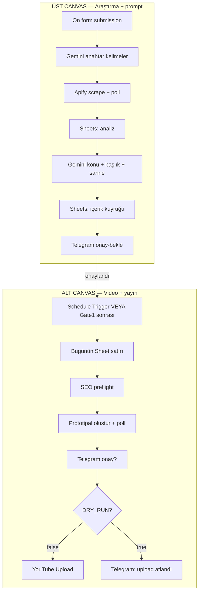

# KANALLAR — Adım adım akış (AI / insan okuma kılavuzu)

Bu dosya GitHub’dan okuyan **ChatGPT, Claude, Cursor** ve insanlar içindir.  
Amaç: projeyi açınca **nasıl çalıştığını** tek başına anlayabilmek.

| | |
|--|--|
| **Birincil sistem** | n8n (orchestration) |
| **Canlı workflow adı** | `PRIMARY: YouTube Full (sade)` |
| **Repo JSON** | [`n8n/workflows/primary/youtube-full-pipeline.json`](../n8n/workflows/primary/youtube-full-pipeline.json) |
| **Telegram onay chati** | chat id `8715342169` |
| **Güvenlik default** | `DRY_RUN=true`, `AUTO_PUBLISH=false` |

Python worker / Studio / archive Hybrid = **opsiyonel upgrade**. Günlük Shorts üretimi = bu n8n akışı.

---

## 30 saniyelik özet

```
1) Form → Gemini anahtar kelime → Apify YouTube scrape → Sheets
2) Gemini konu / başlık / sahne prompt → Sheets kuyruk
3) Telegram: konu/takvim ONAY?  ← GATE 1 (ücretli video yok)
4) SEO kontrol → Prototipal video üret → bekle
5) Telegram: video ONAY?        ← GATE 2
6) DRY_RUN? → hayır ise YouTube Upload
```

İki insan kapısı var. Gate 1’den önce pahalı video API çağrılmaz. Gate 2 + `DRY_RUN=false` olmadan YouTube’a gitmez.

---

## Büyük resim



---

## BÖLÜM A — Araştırma ve prompt (üst canvas)

### Adım A0 — Tetikleyici
**Node:** `On form submission`  
Operatör formu doldurur (niche, long/short sayısı, dil, başlangıç tarihi).  
Bu, manuel “bugün araştırma çalıştır” düğmesidir.

### Adım A1 — Girdileri normalize et
**Node:** `girdiler` (Set)  
Form alanlarını sonraki LLM/Apify node’larının beklediği alan adlarına çevirir.

### Adım A2 — Anahtar kelime üret
**Node:** `anahtar-kelimeler` (Basic LLM Chain + Google Gemini + Structured Output Parser)  
Niche’ten arama terimleri üretir (`terim1`…`terim10`).  
**Maliyet:** Gemini (ucuz). Henüz video yok.

### Adım A3 — Apify ile YouTube scrape
**Node’lar (sırayla):**
1. `basla` — Apify actor run başlat  
2. `Wait1` — bekle  
3. `kontrol` — run bitti mi?  
4. `If1` — bitmediyse tekrar `Wait1`; bittiyse devam  
5. `sonuc` — dataset items çek  
6. `en-iyiler` (Code) — en iyi videoları / sinyalleri süz  

**Maliyet:** Apify. Hâlâ video render yok.

### Adım A4 — Analizi Sheet’e yaz
**Node:** `analiz-kayit` (Google Sheets Append)  
Ham araştırma satırlarını kaydeder.

### Adım A5 — Konu fikirleri üret (döngü)
**Node’lar:**
1. `icerik-bilgileri` — loop için alan hazırla  
2. `Loop Over Items`  
3. `konu-yazarı` (Gemini) — her item için konu metni  
4. `ai-konu-guncelle` — Sheet satırını güncelle  
5. `Aggregate` — loop çıktısını topla  

### Adım A6 — Başlık + açıklama + yayın takvimi
**Node’lar:**
1. `icerik-fikir-baslik-aciklama` (Gemini + Auto-fixing Output Parser)  
2. `icerik` (Code) — long_form / shorts listesini Sheet satırlarına çevir  
3. `icerik-kayit` — kuyruğa yaz (`tarih`, `baslik`, `aciklama`, `ana-tema`, `durum=planlandı`, …)

Bu satırlar **üretim kuyruğudur** (checkpoint).

### Adım A7 — Sahne promptları (döngü)
**Node’lar:**
1. `Loop Over Items1`  
2. `If` — hangi prompt yolunu kullanacağını seç  
3. `sahne-promptlari` **veya** `Basic LLM Chain` (Gemini + parser)  
4. `prompt-guncelle` / `prompt-guncelle1` — Sheet’e sahne promptlarını yaz  

Prototipal’e gidecek görsel/senaryo metinleri burada tamamlanır.

### Adım A8 — GATE 1: Telegram konu / takvim onayı
**Node:** `onay-bekle` (Telegram `sendAndWait`)  
**Chat:** `8715342169`  
Mesaj: planlanan tarihler + başlıklar. Operatör Approve / Reject.

**Node:** `If2` → onaylandıysa `Get row(s) in sheet2` → `onaylandi` (Sheet güncelle).

**Buradan önce Prototipal / YouTube çağrılmaz.**

### Adım A9 — Köprü: üretime geç
**Node:** `onaylandi` → doğrudan `tarih`  
Konu onayından sonra alt canvas’ın (video) girişine bağlanır.

---

## BÖLÜM B — Video üretimi ve yayın (alt canvas)

İki giriş:
- **B-Schedule:** `Schedule Trigger` → her gün çalışır  
- **B-Bridge:** Gate 1 sonrası `onaylandi` → `tarih`

### Adım B1 — Bugünün tarihi
**Node:** `tarih` (Code)  
Bugünün tarihini üretir; Sheet’teki `tarih` ile eşleştirmek için.

### Adım B2 — Kuyruktan satır seç
**Node:** `icerikler` (Google Sheets Get)  
Planlanmış içerikleri okur.

**Node:** `tarih-kontrol` (If)  
`bugunTarih == satır.tarih` ise devam; değilse bu satırı atla.

### Adım B3 — SEO preflight (ücretli API öncesi)
**Node’lar:** `SEO preflight` (Code) → `SEO OK?` (If)
- Short başlık ≤ 40 karakter (long ≤ 60)  
- Açıklama boş / çok kısa olmamalı  

Fail → `SEO fail` (Telegram) → **Prototipal çağrılmaz.**

### Adım B4 — Video oluştur (Prototipal)
**Node:** `olustur` (HTTP Request)  
Prompt’larla video job başlatır.

### Adım B5 — Bitene kadar poll
**Node’lar:**
1. `Wait`  
2. `video-kontrol` — status  
3. `video-bitti?` (If) — bitmediyse tekrar `Wait`; bittiyse devam  

### Adım B6 — GATE 2: Telegram video onayı
**Node:** `onay?` (Telegram `sendAndWait`) — video URL ile “paylaşılsın mı?”  
**Node:** `video-onay?` (If)
- Evet → `indir`  
- Hayır → `yeni-video-onay` → `If3` → gerekirse tekrar `olustur`

### Adım B7 — Videoyu indir
**Node:** `indir` (HTTP)  
Final MP4/URL’yi alır.

### Adım B8 — DRY_RUN güvenlik kapısı
**Node:** `DRY_RUN?` (If)
- `DRY_RUN=true` (default) → `DRY_RUN skip` (Telegram: upload atlandı)  
- `DRY_RUN=false` → `Upload a video` (n8n YouTube node)

**Hiçbir şey `DRY_RUN=true` iken YouTube’a gitmez.**

---

## Node isimleri ↔ anlam (hızlı sözlük)

| Node | Anlam |
|------|--------|
| `girdiler` | Form → alan map |
| `anahtar-kelimeler` | Gemini search terms |
| `basla` / `kontrol` / `sonuc` | Apify start / poll / fetch |
| `konu-yazarı` | Konu metni |
| `icerik-fikir-baslik-aciklama` | Title + description + schedule |
| `sahne-promptlari` | Scene prompts for video API |
| `onay-bekle` | Gate 1 Telegram |
| `onaylandi` | Sheet’te onaylandı + bridge |
| `tarih` / `tarih-kontrol` | Bugünlük satır seçimi |
| `SEO preflight` | Packaging check |
| `olustur` | Prototipal create |
| `video-kontrol` / `video-bitti?` | Render poll |
| `onay?` / `video-onay?` | Gate 2 Telegram |
| `DRY_RUN?` | Upload kill-switch |
| `Upload a video` | YouTube |

---

## Google Sheets rolü

Sheets = iş kuyruğu + checkpoint (AgentTube’daki SQLite job kaydının n8n karşılığı).

Tipik kolonlar:
- `tarih` — planlanan gün  
- `baslik`, `aciklama` — YouTube paketi  
- `ana-tema`, `sahne-prompt` — video API girdisi  
- `durum` — `planlandı` / onaylandı / …  
- `format` — `short` / `long`

Bir satır bozulursa: Sheet’i düzelt → Schedule veya Gate1 sonrası tekrar akışa sok. Tüm canvas’ı yeniden kurma.

---

## Credential / env checklist

n8n’de bağlı olmalı:
1. Google Gemini (PaLM)  
2. Google Sheets OAuth  
3. Telegram Bot → chat `8715342169`  
4. YouTube OAuth (sadece `DRY_RUN=false` testinde)  
5. Apify token (URL’de boş `token=` bırakılmış; credential ile doldurulmalı)  
6. Prototipal HTTP (Bearer)

n8n Variables:
```
DRY_RUN=true
AUTO_PUBLISH=false
```

---

## Bilerek primary OLMAYAN şeyler

| Yol | Durum |
|-----|--------|
| `n8n/archive/*` | Eski stub / Hybrid — kullanma |
| `apps/studio` Python API | Upgrade kit |
| Postgres state machine | Upgrade — Sheets primary |

---

## AI’lere talimat (ChatGPT / Claude)

Bu repo hakkında soru sorulursa:

1. Önce **bu dosyayı** ve [`youtube-full-pipeline.json`](../n8n/workflows/primary/youtube-full-pipeline.json) oku.  
2. Akışı **Gate 1 → media → Gate 2 → DRY_RUN → YouTube** diye anlat.  
3. Hybrid / archive / worker’ı “opsiyonel” de; primary sanma.  
4. Secret uydurma; JSON’daki boş `token=` / `Bearer ` kasıtlı.  
5. Canlı n8n execution logunu GitHub’dan göremezsin — sadece tasarımı görürsün.

Daha kısa özet: [`N8N_HOW_IT_WORKS.md`](N8N_HOW_IT_WORKS.md) · Import: [`../n8n/README.md`](../n8n/README.md)
