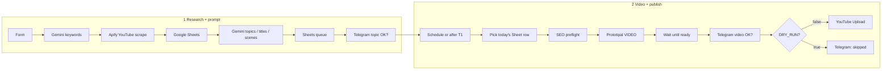

# How n8n works in this repo

**n8n is the operating system.** Everything important for daily Shorts production lives in importable workflow JSON under `n8n/workflows/`. Python worker / Studio are an **upgrade kit**, not the primary path.

## Open this first in GitHub

| File | What it is |
|------|------------|
| [`n8n/workflows/primary/youtube-full-pipeline.json`](../n8n/workflows/primary/youtube-full-pipeline.json) | **Primary** — research + prompt + video + YouTube (one canvas) |
| [`n8n/README.md`](../n8n/README.md) | Import, credentials, variables |
| This doc | End-to-end behavior |

Live cloud name: **`PRIMARY: YouTube Full (sade)`**.

Canvas: **üst** araştırma/prompt (Cursor kutuları), **alt** video/YouTube (Y+2200 boşluk). Tek workflow; kopyalar silindi.

## One-picture flow



## Two human gates (money protection)

1. **Topic / plan gate** — Telegram after Sheets has titles & prompts. No paid video API until approved.
2. **Video gate** — Telegram after Prototipal finishes. Upload only if approved **and** `DRY_RUN≠true`.

## Triggers

| Trigger | When |
|---------|------|
| **On form submission** | Manual research run (niche / counts / language) |
| **Schedule Trigger** | Daily: pick Sheet rows whose `tarih` = today and produce |
| Bridge `→ videoya gec` | After Telegram topic approval, continue into produce path |

## Google Sheets = queue (checkpoint)

Cursor templates treat Sheets as the job board (same idea as AgentTube’s SQLite checkpoints):

| Typical column | Role |
|----------------|------|
| `tarih` | Planned publish day |
| `baslik` / `aciklama` | YouTube packaging |
| `ana-tema` / `sahne-prompt` | Prototipal prompts |
| `durum` | Checkpoint (`planlandı`, approved, etc.) |

Re-run safely by fixing the row and letting Schedule pick it again — don’t rebuild the whole canvas.

## Env / variables (n8n)

```
DRY_RUN=true          # blocks YouTube upload node
AUTO_PUBLISH=false    # documented safety; human Telegram still required
```

## Credentials required

Gemini · Google Sheets · Telegram · YouTube OAuth · Apify · Prototipal HTTP access.

## What is *not* primary

- `n8n/workflows/kanallar-shorts-factory.json` — Hybrid worker path (Postgres / FFmpeg / Kie wow)
- Modular stubs `00-`…`11-` — building blocks for later
- Python `apps/studio` — API for Hybrid, not needed to run Cursor primary

## Import / update rule

1. Edit JSON in git under `n8n/workflows/primary/`.
2. Import or API-update the live n8n workflow.
3. Keep workflows **inactive** until credentials + `DRY_RUN=true` verified.
4. Never commit API tokens inside HTTP URLs.
